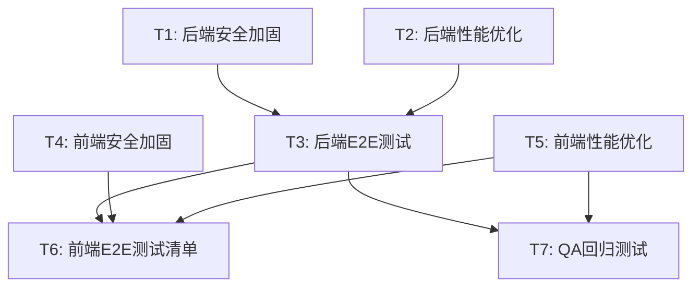

# 宠宝树项目 — E2E全流程测试 + 性能与安全加固 系统设计

> 架构师：高见远 | 日期：2025-07

---

## 一、实现方案总览

本文档覆盖 6 大任务的具体实现方案，每项包含文件路径、修改内容概述、新增文件和依赖变更。

---

## 二、任务 1：后端安全加固

### 2.1 速率限制（slowapi）

**目标**：全局 60次/分钟；send-code 接口 1次/分钟/手机号

**修改文件**：

| 文件路径 | 修改内容 |
|---------|---------|
| `main.py` | 引入 `slowapi` 中间件，注册 `Limiter` 实例到 app.state；添加 `@_limiter.limit("60/minute")` 全局限流装饰器（通过中间件方式实现）；异常处理器返回 429 JSON |
| `routes/auth.py` | 在 `send_code` 端点上添加 `@limiter.limit("1/minute")` 装饰器；需要从 request 获取客户端 IP 或手机号作为 key |
| `requirements.txt` | 新增 `slowapi==0.1.9` |

**实现细节**：

```python
# main.py 新增
from slowapi import Limiter, _rate_limit_exceeded_handler
from slowapi.util import get_remote_address
from slowapi.errors import RateLimitExceeded
from slowapi.middleware import SlowAPIMiddleware

limiter = Limiter(key_func=get_remote_address, default_limits=["60/minute"])
app.state.limiter = limiter
app.add_exception_handler(RateLimitExceeded, _rate_limit_exceeded_handler)
app.add_middleware(SlowAPIMiddleware)
```

```python
# routes/auth.py send_code 端点
@router.post("/send-code")
@limiter.limit("1/minute")
async def send_code(request: Request, data: SendCodeSchema, db: Session = Depends(get_db)):
    ...
```

### 2.2 安全响应头中间件

**目标**：所有响应自动附加安全头

**新增文件**：

| 文件路径 | 内容 |
|---------|------|
| `middleware/security_headers.py` | ASGI 中间件，为每个响应添加 `X-Content-Type-Options: nosniff`、`X-Frame-Options: DENY`、`X-XSS-Protection: 1; mode=block`、`Referrer-Policy: strict-origin-when-cross-origin`、`Content-Security-Policy: default-src 'none'`（API 场景适用）、`Permissions-Policy: camera=(), microphone=(), geolocation=()` |

**修改文件**：

| 文件路径 | 修改内容 |
|---------|---------|
| `main.py` | 注册 `SecurityHeadersMiddleware`，位于中间件链最外层 |

**实现细节**：

```python
# middleware/security_headers.py
class SecurityHeadersMiddleware(BaseHTTPMiddleware):
    async def dispatch(self, request: Request, call_next):
        response = await call_next(request)
        response.headers["X-Content-Type-Options"] = "nosniff"
        response.headers["X-Frame-Options"] = "DENY"
        response.headers["X-XSS-Protection"] = "1; mode=block"
        response.headers["Referrer-Policy"] = "strict-origin-when-cross-origin"
        response.headers["Permissions-Policy"] = "camera=(), microphone=(), geolocation=()"
        return response
```

### 2.3 请求体大小限制

**目标**：限制请求体不超过 10MB

**新增文件**：

| 文件路径 | 内容 |
|---------|------|
| `middleware/body_limit.py` | ASGI 中间件，检查 `content-length` 头；若超过 10MB 返回 413；同时防止无 content-length 的流式大请求体 |

**修改文件**：

| 文件路径 | 修改内容 |
|---------|---------|
| `main.py` | 注册 `BodyLimitMiddleware`，位于路由之前 |

**实现细节**：

```python
# middleware/body_limit.py
MAX_BODY_SIZE = 10 * 1024 * 1024  # 10MB

class BodyLimitMiddleware(BaseHTTPMiddleware):
    async def dispatch(self, request: Request, call_next):
        content_length = request.headers.get("content-length")
        if content_length and int(content_length) > MAX_BODY_SIZE:
            return JSONResponse(status_code=413, content={"code": 413, "message": "请求体过大，最大允许10MB"})
        response = await call_next(request)
        return response
```

### 2.4 文件上传 Magic Number 校验

**修改文件**：

| 文件路径 | 修改内容 |
|---------|---------|
| `middleware/upload.py` | 新增 `validate_file_magic()` 函数，读取文件前 12 字节校验 magic number；在 `validate_file()` 中调用 |

**Magic Number 定义**：

```python
FILE_SIGNATURES = {
    "image/jpeg": [bytes([0xFF, 0xD8, 0xFF])],
    "image/png": [bytes([0x89, 0x50, 0x4E, 0x47, 0x0D, 0x0A, 0x1A, 0x0A])],
    "image/gif": [b"GIF87a", b"GIF89a"],
    "image/webp": [b"RIFF", bytes([0x52, 0x49, 0x46, 0x46])],
}

def validate_file_magic(content: bytes, expected_mime: str) -> bool:
    signatures = FILE_SIGNATURES.get(expected_mime, [])
    return any(content.startswith(sig) for sig in signatures)
```

### 2.5 日志脱敏

**修改文件**：

| 文件路径 | 修改内容 |
|---------|---------|
| `main.py` | 修改 logging middleware，对请求/响应日志中的手机号（`1[3-9]\d{9}`）、token（`Bearer\s+\S+`）进行脱敏替换 |

**实现细节**：

```python
import re

def sanitize_log(text: str) -> str:
    # 手机号脱敏：13812345678 → 138****5678
    text = re.sub(r'(1[3-9]\d)\d{4}(\d{4})', r'\1****\2', text)
    # Token 脱敏：Bearer abc123... → Bearer ****
    text = re.sub(r'(Bearer\s+)\S+', r'\1****', text)
    return text
```

### 2.6 XSS 过滤工具

**新增文件**：

| 文件路径 | 内容 |
|---------|------|
| `utils/sanitize.py` | `sanitize_string()` 函数，使用 `bleach` 库清理 HTML 标签和危险属性；`sanitize_dict()` 递归清理字典 |

**修改文件**：

| 文件路径 | 修改内容 |
|---------|---------|
| `routes/auth.py` | 在 `update_profile` 和 `create_profile` 端点中，对 `nickname`、`kennel_name`、`address` 等用户输入字段调用 `sanitize_string()` |
| `routes/feedback.py` | 对 `content`、`contact` 字段调用 `sanitize_string()` |
| `routes/pets.py` | 对 `name`、`breed` 字段调用 `sanitize_string()` |
| `requirements.txt` | 新增 `bleach==6.1.0` |

**实现细节**：

```python
# utils/sanitize.py
import bleach

ALLOWED_TAGS = []  # API 不允许任何 HTML 标签
ALLOWED_ATTRIBUTES = {}

def sanitize_string(value: str) -> str:
    if not isinstance(value, str):
        return value
    return bleach.clean(value, tags=ALLOWED_TAGS, attributes=ALLOWED_ATTRIBUTES, strip=True)

def sanitize_dict(data: dict, fields: list[str]) -> dict:
    for field in fields:
        if field in data and isinstance(data[field], str):
            data[field] = sanitize_string(data[field])
    return data
```

---

## 三、任务 2：后端性能优化

### 3.1 MySQL 连接池配置

**修改文件**：

| 文件路径 | 修改内容 |
|---------|---------|
| `config/database.py` | 在 `create_engine()` 调用中添加连接池参数；仅当 `DATABASE_URL` 以 `mysql` 开头时启用 |

**实现细节**：

```python
# config/database.py
from urllib.parse import urlparse

def get_engine_args(database_url: str) -> dict:
    parsed = urlparse(database_url)
    args = {}
    if parsed.scheme.startswith("mysql"):
        args.update({
            "pool_size": 10,
            "max_overflow": 20,
            "pool_recycle": 3600,
            "pool_pre_ping": True,
        })
    if parsed.scheme == "sqlite":
        args["connect_args"] = {"check_same_thread": False}
    return args

engine = create_engine(
    DATABASE_URL,
    **get_engine_args(DATABASE_URL)
)
```

### 3.2 外键索引创建

**修改文件**：

| 文件路径 | 修改内容 |
|---------|---------|
| `models/pet.py` | `owner_id` 列添加 `index=True`；`avatar_photo_id` 添加 `index=True` |
| `models/breeding_record.py` | `owner_id`、`mother_id`、`father_id` 列添加 `index=True` |
| `models/health_record.py` | `pet_id`、`owner_id` 列添加 `index=True` |
| `models/subscription.py` | `user_id` 列添加 `index=True`（已有 unique 约束可能隐含索引，显式声明） |
| `models/subscription_order.py` | `user_id` 列添加 `index=True` |
| `models/notification.py` | `user_id` 列添加 `index=True` |
| `models/invite_record.py` | `inviter_id`、`invitee_id` 列添加 `index=True` |
| `models/pet_photo.py` | `pet_id` 列添加 `index=True` |
| `models/pet_tag.py` | `pet_id` 列添加 `index=True` |
| `models/export_task.py` | `user_id` 列添加 `index=True` |
| `models/pedigree_certificate.py` | `pet_id`、`owner_id` 列添加 `index=True` |
| `models/feedback.py` | `user_id` 列添加 `index=True` |

**新增迁移脚本**：

| 文件路径 | 内容 |
|---------|------|
| `migrate_add_fk_indexes.py` | 遍历所有需要加索引的表/列，执行 `CREATE INDEX IF NOT EXISTS` 语句（兼容 SQLite 和 MySQL） |

### 3.3 通用分页工具

**新增文件**：

| 文件路径 | 内容 |
|---------|------|
| `utils/pagination.py` | `paginate()` 函数：接受 query、page、page_size 参数，返回 `{"items": [...], "total": int, "page": int, "page_size": int, "pages": int}` |

**修改文件**：

| 文件路径 | 修改内容 |
|---------|---------|
| `routes/pets.py` | 替换手动 offset/limit 为 `paginate()` 调用 |
| `routes/breeding.py` | 替换手动 offset/limit 为 `paginate()` 调用 |
| `routes/health.py` | 替换手动 offset/limit 为 `paginate()` 调用 |
| `routes/subscription.py` | 支付历史分页改用 `paginate()` |
| `routes/notifications.py` | 通知列表分页改用 `paginate()` |
| `routes/export.py` | 导出任务列表分页改用 `paginate()` |

**实现细节**：

```python
# utils/pagination.py
from math import ceil
from fastapi import Query
from typing import Optional

async def get_pagination_params(
    page: int = Query(1, ge=1, description="页码"),
    page_size: int = Query(20, ge=1, le=100, description="每页条数"),
):
    return {"page": page, "page_size": page_size}

def paginate(query, page: int, page_size: int):
    total = query.count()
    items = query.offset((page - 1) * page_size).limit(page_size).all()
    return {
        "items": items,
        "total": total,
        "page": page,
        "page_size": page_size,
        "pages": ceil(total / page_size) if total > 0 else 0,
    }
```

### 3.4 GZip 压缩中间件

**修改文件**：

| 文件路径 | 修改内容 |
|---------|---------|
| `main.py` | 添加 `app.add_middleware(GZipMiddleware, minimum_size=1000)` |

**实现细节**：

```python
from starlette.middleware.gzip import GZipMiddleware
app.add_middleware(GZipMiddleware, minimum_size=1000)
```

### 3.5 静态 API 响应缓存头

**修改文件**：

| 文件路径 | 修改内容 |
|---------|---------|
| `routes/subscription.py` | `/plans` 端点（套餐列表为静态数据）添加 `Cache-Control: public, max-age=3600` 响应头 |
| `routes/auth.py` | `/limits` 端点添加 `Cache-Control: private, max-age=300` 响应头 |

---

## 四、任务 3：后端 E2E 全流程测试

### 4.1 扩展 conftest.py

**修改文件**：

| 文件路径 | 修改内容 |
|---------|---------|
| `tests/conftest.py` | 新增 fixture：`second_auth_client`（第二个用户客户端，用于测试邀请等跨用户场景）、`create_pet_helper`（快速创建宠物的工具函数）、`create_breeding_helper`、`create_health_helper`；改进 `setup_database` 确保测试隔离 |

### 4.2 新增测试文件

| 文件路径 | 覆盖范围 | 测试数量（约） |
|---------|---------|-------------|
| `tests/test_breeding.py` | 繁育记录 CRUD、近亲检测 | 8 |
| `tests/test_health.py` | 健康记录 CRUD、提醒 | 6 |
| `tests/test_invite.py` | 获取邀请码、兑换邀请码、邀请记录、邀请统计 | 6 |
| `tests/test_subscription.py` | 扩展现有：当前订阅、用量、升级、创建订单、支付回调、取消、支付历史 | 10 |
| `tests/test_notifications.py` | 通知列表、标记已读、全部已读、未读计数 | 5 |
| `tests/test_feedback.py` | 提交反馈（正常 + 边界：少于10字）、XSS 输入 | 4 |
| `tests/test_certificates.py` | 证书列表、创建、颁发、撤销 | 5 |
| `tests/test_export.py` | 导出任务列表、创建导出 | 3 |
| `tests/test_security.py` | 速率限制、安全响应头、请求体过大、文件 magic number 校验、XSS 过滤 | 8 |

**扩展现有测试**：

| 文件路径 | 修改内容 |
|---------|---------|
| `tests/test_auth.py` | 新增：send-code 速率限制、profile XSS 输入测试 |
| `tests/test_upload.py` | 新增：magic number 校验测试（伪造扩展名的文件） |

### 4.3 关键测试场景设计

**test_breeding.py**：
- 创建繁育记录（正常）
- 创建繁育记录（缺失必填字段 422）
- 获取繁育记录列表
- 获取单条繁育记录
- 更新繁育记录
- 删除繁育记录
- 近亲检测 — 无近亲
- 近亲检测 — 存在近亲

**test_security.py**：
- 全局速率限制 — 超过 60次/分钟 返回 429
- send-code 速率限制 — 超过 1次/分钟 返回 429
- 安全响应头 — 所有响应包含 X-Content-Type-Options 等
- 请求体过大 — 超过 10MB 返回 413
- 文件上传 magic number — 伪造 .jpg 扩展名但内容为文本，返回 400
- XSS 过滤 — nickname 含 `<script>` 标签被清理
- XSS 过滤 — feedback content 含 HTML 被清理
- 未认证访问 — 返回 401

**test_subscription.py**（扩展）：
- 获取套餐列表（含缓存头验证）
- 获取当前订阅（免费用户）
- 获取用量统计
- 升级订阅
- 创建订单
- 支付回调
- 取消订阅
- 支付历史（分页）
- Pro 用户专属功能访问控制
- 免费用户访问 Pro 功能被拒

---

## 五、任务 4：前端安全加固

### 5.1 输入校验工具

**新增文件**：

| 文件路径 | 内容 |
|---------|------|
| `utils/validators.js` | 通用校验函数：`validateRequired()`、`validatePhone()`、`validateLength()`、`validateNickname()`、`validateBreed()`、`sanitizeInput()` |

**实现细节**：

```javascript
// utils/validators.js
const validatePhone = (phone) => /^1[3-9]\d{9}$/.test(phone)
const validateNickname = (name) => name && name.trim().length >= 1 && name.trim().length <= 30
const validateBreed = (breed) => breed && breed.trim().length >= 1 && breed.trim().length <= 50
const validateLength = (value, min, max) => value && value.trim().length >= min && value.trim().length <= max
const sanitizeInput = (input) => input.replace(/<[^>]*>/g, '').trim()

module.exports = { validatePhone, validateNickname, validateBreed, validateLength, sanitizeInput }
```

### 5.2 API 重试机制

**修改文件**：

| 文件路径 | 修改内容 |
|---------|---------|
| `utils/api.js` | 在 `request()` 中添加自动重试逻辑：网络错误或 5xx 自动重试最多 2 次，间隔 1s/2s 指数退避；401 不重试直接跳登录；增加请求超时配置（默认 15s，上传 60s）；增加 `retryable` 选项 |

**实现细节**：

```javascript
// utils/api.js 新增重试逻辑
const request = (options, retryCount = 0) => {
  const maxRetries = options.retry !== false ? 2 : 0
  const timeout = options.timeout || (options.method === 'UPLOAD' ? 60000 : 15000)

  return new Promise((resolve, reject) => {
    const task = wx.request({
      ...options,
      timeout,
      success: (res) => {
        if (res.statusCode === 401) {
          // 跳转登录，不重试
          handleUnauthorized()
          return reject(res)
        }
        if (res.statusCode >= 500 && retryCount < maxRetries) {
          const delay = Math.pow(2, retryCount) * 1000
          setTimeout(() => request(options, retryCount + 1).then(resolve).catch(reject), delay)
          return
        }
        resolve(res)
      },
      fail: (err) => {
        if (retryCount < maxRetries) {
          const delay = Math.pow(2, retryCount) * 1000
          setTimeout(() => request(options, retryCount + 1).then(resolve).catch(reject), delay)
          return
        }
        reject(err)
      }
    })
  })
}
```

### 5.3 删除确认弹窗

**修改文件**：

| 文件路径 | 修改内容 |
|---------|---------|
| `pages/pets/detail.js` | 删除宠物前添加 `wx.showModal` 确认 |
| `pages/breeding/detail.js` | 删除繁育记录前添加 `wx.showModal` 确认 |
| `pages/health/detail.js` | 删除健康记录前添加 `wx.showModal` 确认 |
| `pages/photos/detail.js` | 删除照片前添加 `wx.showModal` 确认 |

**实现细节**：

```javascript
// 通用删除确认
const confirmDelete = (title, content, onConfirm) => {
  wx.showModal({
    title: title || '确认删除',
    content: content || '删除后不可恢复，是否继续？',
    confirmColor: '#ff4d4f',
    success: (res) => {
      if (res.confirm) onConfirm()
    }
  })
}
```

### 5.4 Token 安全审计

**修改文件**：

| 文件路径 | 修改内容 |
|---------|---------|
| `utils/api.js` | 添加 Token 过期本地检测：解析 JWT exp 字段，若已过期则直接触发重新登录而非等 401；不将 token 输出到 console.log |
| `app.js` | 清理 `console.log` 中的 token 输出；`onLaunch` 中检查本地 token 有效性 |

---

## 六、任务 5：前端性能优化

### 6.1 setData 优化

**修改文件**：

| 文件路径 | 修改内容 |
|---------|---------|
| `pages/pets/list.js` | 列表数据增量 setData：只传递新增项，不整页覆盖；分离 UI 状态和数据状态 |
| `pages/breeding/list.js` | 同上 |
| `pages/health/list.js` | 同上 |
| `pages/notifications/list.js` | 同上 |

**实现细节**：

```javascript
// 增量 setData 模式
loadMore() {
  const newData = fetchPageData(this.data.page)
  const appendItems = newData.items
  this.setData({
    [`list[${this.data.list.length}]`]: appendItems[0],  // 按索引追加
    // ... 或使用数组合并路径
    page: this.data.page + 1,
    hasMore: newData.has_more
  })
}
```

### 6.2 图片懒加载

**修改文件**：

| 文件路径 | 修改内容 |
|---------|---------|
| `pages/pets/list.wxml` | 所有 `<image>` 标签添加 `lazy-load` 属性 |
| `pages/photos/list.wxml` | 同上 |
| `pages/breeding/list.wxml` | 同上 |
| `pages/pets/detail.wxml` | 宠物头像和照片列表添加 `lazy-load` |

### 6.3 列表分页加载

**修改文件**：

| 文件路径 | 修改内容 |
|---------|---------|
| `pages/pets/list.js` | 实现上拉加载更多（`onReachBottom`），配合后端分页 API |
| `pages/breeding/list.js` | 同上 |
| `pages/health/list.js` | 同上 |
| `pages/notifications/list.js` | 同上 |
| `pages/pets/list.json` | 添加 `"enablePullDownRefresh": true` |
| `pages/breeding/list.json` | 添加 `"enablePullDownRefresh": true` |
| `pages/health/list.json` | 添加 `"enablePullDownRefresh": true` |
| `pages/notifications/list.json` | 添加 `"enablePullDownRefresh": true` |

### 6.4 分包预加载

**修改文件**：

| 文件路径 | 修改内容 |
|---------|---------|
| `app.json` | 配置 `preloadRule`：在首页时预加载核心子包；优化 `subpackages` 分包策略（如有） |

**实现细节**：

```json
{
  "preloadRule": {
    "pages/index/index": {
      "network": "all",
      "packages": ["pages/breeding/list", "pages/health/list"]
    }
  }
}
```

---

## 七、任务 6：前端 E2E 测试清单

### 7.1 新增文件

| 文件路径 | 内容 |
|---------|------|
| `docs/e2e-test-checklist.md` | 10 大核心流程验收文档，含测试步骤、预期结果、通过标准 |

### 7.2 测试清单内容

1. **用户登录/注册流程**：微信登录 → 获取 token → 进入首页
2. **宠物管理全流程**：创建宠物 → 查看列表 → 查看详情 → 编辑 → 删除
3. **繁育记录全流程**：创建繁育记录 → 近亲检测 → 查看详情 → 编辑 → 删除
4. **健康记录全流程**：创建健康记录 → 查看列表 → 提醒功能 → 删除
5. **照片管理全流程**：上传照片 → 设置封面 → 删除照片
6. **订阅与支付流程**：查看套餐 → 升级 Pro → 支付回调 → 查看订阅状态
7. **邀请系统流程**：获取邀请码 → 新用户兑换 → 查看邀请记录/统计
8. **通知系统流程**：触发通知 → 查看列表 → 标记已读 → 全部已读
9. **反馈流程**：提交反馈 → 输入校验 → 提交成功
10. **数据导出流程**（Pro）：创建导出任务 → 查看导出列表

每个流程含：前置条件、操作步骤（含页面路径）、预期结果、异常场景、安全校验点。

---

## 八、新增文件汇总

| 文件路径 | 所属任务 |
|---------|---------|
| `middleware/security_headers.py` | T1 后端安全 |
| `middleware/body_limit.py` | T1 后端安全 |
| `utils/sanitize.py` | T1 后端安全 |
| `utils/pagination.py` | T2 后端性能 |
| `migrate_add_fk_indexes.py` | T2 后端性能 |
| `tests/test_breeding.py` | T3 E2E测试 |
| `tests/test_health.py` | T3 E2E测试 |
| `tests/test_invite.py` | T3 E2E测试 |
| `tests/test_notifications.py` | T3 E2E测试 |
| `tests/test_feedback.py` | T3 E2E测试 |
| `tests/test_certificates.py` | T3 E2E测试 |
| `tests/test_export.py` | T3 E2E测试 |
| `tests/test_security.py` | T3 E2E测试 |
| `chongbaoshu-miniapp/utils/validators.js` | T4 前端安全 |
| `chongbaoshu-miniapp/docs/e2e-test-checklist.md` | T6 测试清单 |

---

## 九、依赖包变更

### 后端 requirements.txt 新增

| 包名 | 版本 | 用途 |
|-----|------|------|
| `slowapi` | 0.1.9 | API 速率限制 |
| `bleach` | 6.1.0 | XSS 输入过滤 |

### 前端无新增依赖（均为微信小程序原生 API 实现）

---

## 十、任务执行顺序与依赖关系

### 依赖图



### 并行策略

| 阶段 | 可并行任务 | 说明 |
|------|-----------|------|
| 第一阶段 | **T1 + T2 + T4 + T5** | 后端安全、后端性能、前端安全、前端性能四项互不依赖，全部可并行 |
| 第二阶段 | **T3** | 等 T1、T2 完成后执行，因为测试用例需要校验安全加固和性能优化的效果 |
| 第三阶段 | **T6** | 等 T3、T4、T5 全部完成后编写验收清单 |
| 第四阶段 | **T7** | QA 回归，等 T3、T5 完成 |

### 推荐执行顺序

1. **并行启动**：T1（后端安全）+ T2（后端性能）+ T4（前端安全）+ T5（前端性能）
2. **T1/T2 完成后**：启动 T3（后端 E2E 测试）
3. **T3/T4/T5 全部完成后**：启动 T6（前端 E2E 测试清单）
4. **T3/T5 完成后**：启动 T7（QA 回归测试）

---

## 十一、共享知识（工程师实施参考）

### 后端约定

- 所有 API 响应统一格式：`{"code": int, "data": any, "message": str}`
- 认证使用 JWT（HS256），token 存于 `Authorization: Bearer <token>`
- 所有日期字段使用 ISO 8601 UTC 格式
- 数据库：开发/测试用 SQLite，生产用 MySQL
- 测试使用内存 SQLite + StaticPool，每次测试自动 create_all/drop_all
- 分页返回格式：`{"items": [], "total": int, "page": int, "page_size": int, "pages": int}`
- 速率限制异常返回 429，请求体过大返回 413，认证失败返回 401
- 安全头中间件应在中间件链最外层，GZip 应在其后，BodyLimit 在路由之前

### 前端约定

- 微信小程序原生框架，不使用第三方 UI 库
- API 请求统一走 `utils/api.js` 封装
- Token 存储在 `wx.getStorageSync('token')`
- 所有用户输入必须前端校验 + 后端二次校验
- 列表页面必须支持下拉刷新 + 上拉加载更多
- 删除操作必须二次确认

### 测试约定

- 测试文件按路由模块命名：`test_{module}.py`
- 每个 test 文件内按 CRUD 顺序组织测试用例
- 使用 `auth_client` fixture 进行认证请求，`client` 进行未认证请求
- 安全测试集中在 `test_security.py`，不在各模块重复
- 测试覆盖率目标：所有 11 个路由模块 ≥ 80%
